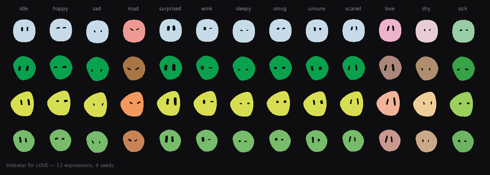
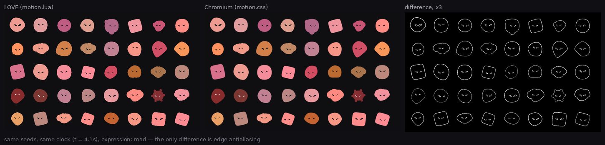

go to the live demo and click "run"

https://hmatt1.github.io/blobatar-love/

.  
.  
.  
.  

  
# blobatar for LÖVE

A pure Lua port of [blobatar](https://github.com/Alain00/blobatar): deterministic
geometric avatars generated from any string, with a LÖVE renderer on top.

The same name renders the same blobatar here as it does in the JavaScript
library. The hash, the trait ranges, the six shape thresholds, the OKLCh tone
set, the containment arithmetic, the thirteen expressions and the whole motion
layer are the same numbers, verified against the original rather than assumed.



```lua
local blobatar = require("blobatar")

local b = blobatar.new("alain@example.com")

function love.update(dt)
  b:setHover(b:hitTest(love.mouse.getPosition()))
  b:update(dt)
end

function love.draw()
  b:draw(20, 20, 96)
end
```

The library has no dependencies. `blobatar/love.lua` is the only file that
touches LÖVE, and it is loaded on demand, so everything else runs under plain
Lua 5.1 through 5.4 or LuaJIT.

## Contents

1. [Install](#1-install)
2. [Drawing](#2-drawing)
3. [Expressions](#3-expressions)
4. [Motion](#4-motion)
5. [Options](#5-options)
6. [Without LÖVE](#6-without-löve)
7. [What the port guarantees](#7-what-the-port-guarantees)
8. [Where it diverges](#8-where-it-diverges)
9. [Tests](#9-tests)
10. [Module map](#10-module-map)
11. [License](#11-license)

## 1. Install

Copy the `blobatar/` directory into your project and require it:

```lua
local blobatar = require("blobatar")        -- if it sits at the project root
local blobatar = require("libs.blobatar")   -- if it sits in libs/
```

Every module derives its own package prefix from the name it was loaded under,
so the directory can go anywhere and can be renamed.

Turn MSAA on for smooth edges. The shapes are filled polygons, and without
multisampling their outlines stair-step at small sizes:

```lua
function love.conf(t)
  t.window.msaa = 4
end
```

Run the demo with `love .` from the repository root. Hover a blobatar to wake it;
the number and letter keys switch the expression on every blobatar at once.

## 2. Drawing

`blobatar.new(name, opts)` returns a drawable. Keep it around; it holds the
resolved palette, the flattened geometry and the animation state.

```lua
local b = blobatar.new("alain@example.com", { animate = "hover" })

b:update(dt)          -- advance the clock
b:draw(x, y, size)    -- draw into a size by size box with its top-left at x, y
```

A blobatar does not fill that box. The body is a silhouette inside a 100 unit
frame, and how much of the frame it takes depends on which shape the seed drew.
A sun with nine petals reaches further than a round.

### Hit testing

```lua
b:setHover(b:hitTest(love.mouse.getPosition()))
```

`hitTest` follows the silhouette rather than a bounding box, so the transparent
corners around a round blobatar are not part of it. Pass the same `x, y, size`
you draw with, or omit them to reuse the last draw call's.

### Flattening to a texture

```lua
local canvas = b:toImage(128)
love.graphics.draw(canvas, x, y)
```

Two reasons to use it. A grid of hundreds of static blobatars costs one draw call
each this way rather than a transform stack each. And a blobatar drawn at less
than full alpha has to go through it, because the body is several overlapping
shapes sharing one fill: at 50% alpha the overlaps double up, where a texture
fades as one object.

The canvas is yours to release. Nothing caches it, because the state it captured
is a moment rather than a property.

### Releasing

```lua
b:release()
```

Frees the meshes. Only worth calling on a grid that churns; otherwise collection
handles it.

## 3. Expressions

Thirteen poses, set by you and held until you change them. Nothing returns to
idle on its own and there are no timers. A burst is `setExpression` and your own
countdown.

```lua
b:setExpression("happy")
b:setExpression(blobatar.expression.mad)   -- a value works too
b:setExpression(nil)                       -- back to idle
```

| | | |
|---|---|---|
| `idle` | `happy` | `sad` |
| `mad` | `surprised` | `wink` |
| `sleepy` | `smug` | `unsure` |
| `scared` | `love` | `shy` |
| `sick` | | |

Four of them move the palette as well as the geometry. `mad` runs red, `love`
rose, `shy` a pale blush, `sick` a bile green. Each tint is derived per seed
rather than being an authored colour, because the style flips its eye between
near-black and near-white with the body's lightness and no fixed red clears
4.5:1 against both.

Setting an expression morphs into it over 300ms and back out over 400ms. That
asymmetry is in the original: a transition takes its duration from the state it
is heading to.

## 4. Motion

The idle animation is six loops: breathe, bob, blink, saccade, an eye-wrap that
foreshortens a glance, and a tremor that only the poses spending `shake` can
see. Every one of them is scaled by an amplitude that rises on hover.

```lua
blobatar.new(name, { animate = "hover" })   -- default: one blobatar at a time
blobatar.new(name, { animate = "always" })  -- always running
blobatar.new(name, { animate = false })     -- amplitude pinned at zero
blobatar.new(name, { reduced = true })      -- no loops, no morph, poses still apply
```

`"hover"` is the default because ambient motion seen constantly is motion worth
removing, and because a grid of four hundred blobatars all breathing is four
hundred transform stacks a frame. `"always"` is the escape hatch for the
single-blobatar case: a profile header, an onboarding screen.

`reduced` is the reduced-motion setting. It removes the morph and keeps the
pose, because a pose is meaning and a morph is decoration.

Each blobatar's timing is seeded from its own name. A grid where every blobatar
breathes in unison does not read as a crowd of creatures; it reads as a
heartbeat.

## 5. Options

Everything below is optional and can be passed to `blobatar.new`, `blobatar.svg`
or `blobatar.layout`.

| option | type | what it does |
|---|---|---|
| `expression` | string or value | which pose to hold |
| `animate` | `"hover"`, `"always"`, `false` | idle motion, LÖVE only |
| `reduced` | boolean | holds every pose, runs no loop or morph |
| `hue` | 0-360 | locks the colour, so the name drives shape only |
| `tone` | 0-1 | locks the position in the six-swatch tone set |
| `palette` | table | overrides `bg`, `head` or `eye` outright |
| `traits` | table | pins individual traits |
| `background` | `false`, `true`, `"square"`, `"circle"`, `"squircle"` | the plate behind the figure, off by default |
| `contrast` | boolean | enforces the minimum contrast ratios, on by default |
| `normalize` | boolean | applies NFC, trim and lowercase to the name, on by default |
| `size` | number | emits `width` and `height` on the SVG |
| `title` | string | adds a `<title>` for screen readers, in the SVG |

A colour passed through `palette` bypasses the contrast guarantee, by
definition.

### Trait overrides

`traits` pins individual values, so the name drives only what you leave out.
Each value is the 0-1 position the hash would have produced for that key, in the
same units the layout reads:

```lua
-- Always a sun, always wide eyes, colour and everything else per name.
blobatar.new(user.email, { traits = { shape = 0.95, ["eye.ratio"] = 0 } })
```

Pin every trait and the name stops mattering, which is how you build one fixed
blobatar: pass any constant string alongside a full map.

The layout still runs in full, so the containment guarantees hold under any
combination. An eye cluster that would not fit is scaled down exactly as a
hashed one is, which means an extreme value can land short of where you asked.
`blobatar.layout(name, opts)` reports what it resolved to.

Values outside [0, 1) are clamped, and anything that is not a number falls to 0,
so a bad parse renders a blobatar instead of a path full of NaN.

## 6. Without LÖVE

`require("blobatar")` works in plain Lua. The renderer is only reached through
`blobatar.new`.

```lua
local svg = blobatar.svg("alain@example.com", { size = 96 })
local uri = blobatar.uri("alain@example.com")           -- data:image/svg+xml,...
local l   = blobatar.layout("alain@example.com")        -- numbers, no markup
```

`blobatar.svg` produces markup byte-identical to the JavaScript library's, which
is what `test/parity.lua` compares against. `blobatar.animatedSvg` produces the
animated form, for a host that also serves the original's `motion.css`.

The layout comes back as plain tables:

```lua
l.shape                       -- "round" | "organic" | "boxy" | "nub" | "cloud" | "sun"
l.body.cx, l.body.cy          -- centre, in a 100 unit frame
l.body.rx, l.body.ry, l.body.n, l.body.rot, l.body.radii
l.petals                      -- { { cx =, cy =, r = }, ... }
l.eyes                        -- two of { cx, cy, rx, ry, n, rot }
l.palette.bg, l.palette.head, l.palette.eye
```

Filtering thousands of seeds down to the rare silhouettes costs a hash and some
arithmetic this way.

## 7. What the port guarantees

**Determinism.** The same name renders the same blobatar, here and in any 0.2.x
of the JavaScript library. Numeric ranges, shape thresholds, the tone set and
the expression roster are all part of that contract.

**Contrast.** Eyes clear 4.5:1 against the body at every hue and every tone, and
at every point along every tint's mix rather than only at its ends. Polarity
flips automatically, so the near-black tone gets light eyes rather than an
invisible face.

**Containment.** Eyes stay inside the body and the body stays inside the frame,
across 6000 seeds and across the corners of the trait-override space.

**Name normalization.** Names are NFC-normalized, trimmed and lowercased before
hashing, so `Alain@Example.com` and `alain@example.com` agree, as do the
precomposed and decomposed spellings of `café`. That needed a real Unicode
implementation: `blobatar/unicodedata.lua` carries canonical decompositions,
combining classes, primary composites and the case tables, and `blobatar/utf8x.lua`
implements NFC including Hangul composition and the Final_Sigma rule. It is
loaded on the first non-ASCII name and never for a name that is plain ASCII.

Checked against `String.prototype.normalize` and `toLowerCase` over every
non-surrogate codepoint plus combining, Hangul and sigma-context sequences:
1,117,764 cases, zero differences.

**Portability.** Lua 5.1, 5.2, 5.3, 5.4 and LuaJIT. The 32-bit hash arithmetic
uses LuaJIT's `bit` library when it is there, native operators compiled at
runtime on 5.3+, and a nibble table otherwise.

## 8. Where it diverges

Four things, all deliberate and all small.

**Hit testing uses the rest pose.** A browser hit-tests the animated geometry,
so a blobatar that grows 4% on hover grows its own hit area and a pointer resting
on the edge chatters between the two states. Holding the rest pose costs nothing
and removes that.

**Alpha compositing.** The body is a core shape plus up to nine decoration
circles, and they overlap. In SVG they union because they share one opaque fill.
Draw them at 50% alpha in LÖVE and the overlaps come out darker. Use `toImage`
for that case.

**`Math.cbrt`.** The port uses `x^(1/3)` with one Halley step, which can differ
from V8's fdlibm implementation by one unit in the last place. Every consumer of
it rounds to a byte long before that could matter, and 322,560 colour
comparisons found no difference.

**The last bit of `Math.sin` and `Math.hypot`.** Neither is specified, and
JavaScript engines disagree with each other about them. V8 and JavaScriptCore
return different `Math.hypot` results for about a third of all inputs, so `bun`
and `node` do not agree about the twelfth decimal of a blobatar either. The port
matches V8, since that is what a browser renders with. Nothing survives the
rounding to two decimals in the path data: 64,296 SVG comparisons against both
runtimes found no difference at all.

## 9. Tests

```
luajit test/all.lua          # 67 assertions, no fixtures, no graphics
luajit test/parity.lua       # diffs the port against the original, row by row
```

Both suites pass on LuaJIT and Lua 5.4.

`test/all.lua` is a port of the original's own suite plus the motion layer's,
including the equivalence the animated renderer depends on: that applying a pose
as transforms lands the geometry exactly where baking it into the coordinates
does, checked at 83,616 points across every expression.

`test/parity.lua` re-renders what the TypeScript library produced for a wide
slice of its input space and compares. The last full sweep was 50,000 seeds:

```
  svg          64296 checked  0 failed
  expression   54171 checked  0 failed
  layout       14286 checked  0 failed
  motion       10000 checked  0 failed
  pose            13 checked  0 failed
```

The committed fixture is a 1200-seed sample so the repository stays small.
`tools/gen_fixtures.sh` regenerates it at any width from an upstream checkout.

The motion layer is the one part a fixture cannot check, because it is a port of
a stylesheet. `tools/dump_animated.lua` writes the port's animated markup,
`tools/motion_shot.mjs` loads it into Chromium alongside the original
`motion.css`, freezes every animation at a stated time and screenshots it.
Rendering the same seeds in LÖVE with the clock set to the same time gives two
images that differ only where a rasterizer's edges differ:



Interior pixels are identical. See `test/README.md` for how to run it.

## 10. Module map

| file | what it is |
|---|---|
| `init.lua` | the public API |
| `hash.lua` | seed hashing, a bit-exact port |
| `bit32.lua` | 32-bit arithmetic with three backends |
| `utf8x.lua` | UTF-8, NFC, full lowercase, trim |
| `unicodedata.lua` | generated tables, loaded on the first non-ASCII name |
| `traits.lua` | the trait reader and override clamping |
| `color.lua` | OKLCh, gamut mapping, the contrast walk, the tone ramp, tints |
| `shape.lua` | superellipse and Catmull-Rom blob, as paths |
| `path.lua` | path data, Bézier flattening, polygon helpers |
| `style/blob.lua` | the six-shape layout and its geometry |
| `expression.lua` | the pose channels, the roster, pose baking |
| `render.lua` | seed to palette to geometry |
| `svg.lua` | SVG serialization, static and animated |
| `animate.lua` | per-blobatar seeded motion parameters |
| `easing.lua` | cubic-bezier, keyframes, CSS transitions |
| `motion.lua` | the motion layer as a time-driven transform stack |
| `love.lua` | the LÖVE renderer |
| `util.lua` | the arithmetic that has to agree with JavaScript |

## 11. License

MIT, matching the original.

blobatar is by [Alain](https://github.com/Alain00). This is a port of version
0.2.0. The original's design decisions and most of the reasoning in these
comments are his; the errors in translating them are not.
